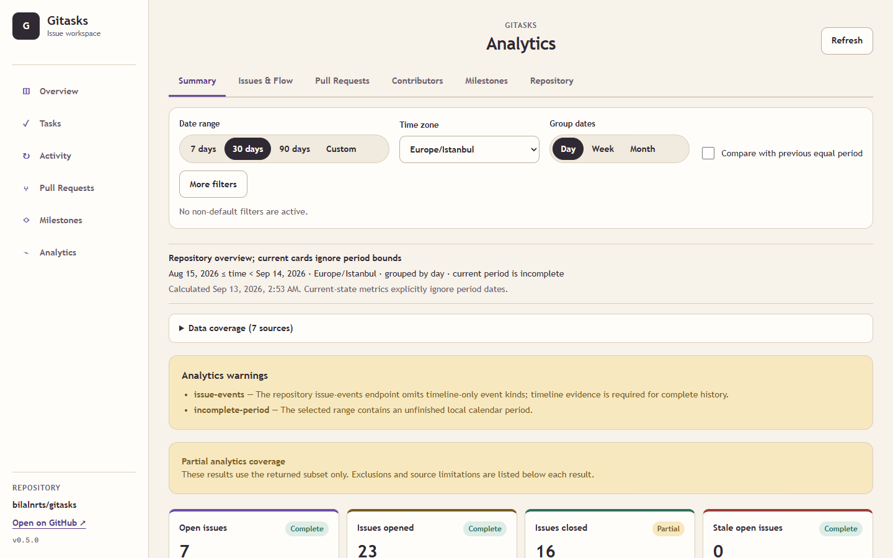

# Gitasks

Gitasks is a local workspace and task protocol for humans and coding agents, powered entirely by GitHub Issues. GitHub remains the source of truth: Gitasks has no local task database, hosted backend, SaaS account, or browser credential store.


> **Release status:** Repository Analytics is implemented for the unreleased 0.5.0 source checkout. A Git tag identifies a source revision, a published GitHub Release is a separate GitHub artifact, and an npm release is a separate registry publication. This README does not claim that `gitasks@0.5.0` is available from npm; the published 0.4.0 install remains documented below.

## Requirements

- Node.js 20 or newer
- Git
- [GitHub CLI](https://cli.github.com/) (`gh`)
- A repository whose `origin` points to `github.com`

Authenticate with the GitHub CLI before using Gitasks:

```bash
gh auth login
gh auth status
```

Gitasks uses the active `gh` authentication and never asks the browser for a token.

## Install and initialize the published 0.4 release

Install the exact 0.4 release in a repository:

```bash
npm install --save-dev gitasks@0.4.0
npx gitasks init
npx gitasks ui
```

These commands install the published 0.4 package. To use the unreleased 0.5 Repository Analytics implementation, run the source checkout as described in [Develop the unreleased 0.5 checkout](#develop-the-unreleased-05-checkout); do not substitute `npm install gitasks@0.5.0` unless that version is independently listed on npm.

The workspace opens at `http://127.0.0.1:4317`. To select another port:

```bash
npx gitasks ui --port 4400
```

`gitasks init` detects the current GitHub repository, verifies `gh` authentication, creates any missing `status:*` labels, and creates missing protocol files:

```text
.gitasks/
  config.json
  protocol.md
AGENTS.md
```

Initialization does not modify issues. An existing `.gitasks/protocol.md` is never replaced. If `AGENTS.md` already contains the `gitasks:start` marker, it is left unchanged; otherwise Gitasks appends its marked section and preserves all existing content. Re-running `init` is safe for consumer customizations.

## Workspace

The workspace has six routes in a persistent sidebar. Each route can be opened directly and revisited with browser Back and Forward. The first five routes retain the 0.4 behavior:

- **Overview** — repository-scoped operational summaries, assigned work, upcoming milestones, and recent updates. An unavailable section is shown as unavailable rather than as a zero.
- **Tasks** — board and list views over the same filtered data. Filter by GitHub state, one or more Gitasks statuses (including Unclassified), assignee, milestone, labels, or search; choose deterministic sorting. The board keeps the six workflow columns and displays unclassified issues separately.
- **Activity** — real repository issue and timeline activity with actor/event filters, an explicit coverage note, and manual pagination.
- **Pull Requests** — browse and manage pull requests, details, reviewers, reviews, checks, files, draft state, assignments, milestones, and guarded merges according to GitHub permissions and repository settings.
- **Milestones** — browse, create, edit, close, and reopen milestones; inspect linked work and GitHub's issue-and-pull-request progress counts.
- **Analytics** — read-only repository flow, contribution, milestone, and repository statistics with explicit formulas, source coverage, chart/table parity, CSV export, and record drill-downs.

Task moves are available through an accessible **Move to** menu in board, list, and detail views. Board cards also support pointer drag from their dedicated handle and touch long-press. Unclassified is not a drop target. A move to the current column or outside a valid target makes no request.

All pages provide explicit loading, empty, filtered-empty, partial, permission or unsupported, pending, error, and retry states where applicable. Data is refreshed explicitly; Gitasks does not poll and does not use WebSockets.

Stop the local server with `Ctrl+C`.

## Repository Analytics (unreleased 0.5)

Open the local workspace and select **Analytics**, or navigate directly to `http://127.0.0.1:4317/analytics`. Analytics requests start only on that route. The Analytics workspace has six tabs:

- **Summary** — a repository-level overview of supported issue, pull-request, contributor, milestone, and release signals.
- **Issues** — current open-work distributions, opened/closed/reopened/completed event counts, evidence-backed durations and status history, stale work, and native dependency signals.
- **Pull Requests** — opened, merged, and closed-unmerged work; current draft, review, and checks state; review activity and evidence-backed wait/merge durations; and change-size distributions.
- **Contributors** — current assignment and review-request ownership plus separate period activity for authored issues, authored and merged pull requests, and submitted reviews. Gitasks does not combine these into a score or ranking.
- **Milestones** — current issue and pull-request progress, remaining assignment and blocked-work signals, and known-history scope and burnup where timeline evidence supports them.
- **Repository** — current language bytes and tags, GitHub-supported commit/code-frequency/contributor history, and published GitHub Releases.



### Filters and time

Analytics supports 7-, 30-, and 90-day ranges plus a custom range; IANA time zone selection; day, week, or month grouping; comparison with the immediately preceding equal-duration period; milestone, label, person, and role filters; bot inclusion; and configurable stale-issue and review-wait thresholds. Custom ranges are rejected before computation when the selected grouping would create more than 4,000 calendar buckets. Controls that do not apply to a metric are disabled rather than silently changing its meaning. Repository-only metrics, for example, do not accept milestone or person filters.

Time is evaluated as UTC instants and grouped by local calendar boundaries in the selected IANA time zone. Periods use an inclusive start and exclusive end, written `[from, to)`. The current day and an unfinished period are marked incomplete. A comparison uses the same elapsed duration immediately before the selected period; percentage change is unavailable when its previous value is zero.

**Current** metrics answer what is true at calculation time and ignore the selected period bounds. **Period event** metrics count source events whose timestamps fall inside the selected period. **Historical** metrics use only defensible source history and state their supported range. Filters based on today's issue or pull-request fields are labeled **current record fields**; they are not presented as event-time classification. GitHub `CLOSED` and Gitasks `DONE` remain separate.

Multi-label and multi-assignee groups can count one record in more than one group, so group totals can exceed the unique-record total. Bots can be included explicitly. Deleted or inaccessible users and unmatched commit authors remain explicit identities rather than being assigned to another contributor.

### Coverage, tables, drill-downs, and CSV

Every result reports its calculation, sample size, source coverage, calculation time, and limitations. Coverage is:

- **complete** when every required page and field for the stated scope was loaded;
- **partial** when a useful subset can be calculated but pages, fields, dates, or records are missing;
- **unsupported** when GitHub does not provide the required source for the repository or scope;
- **pending** when GitHub is still preparing a statistics result; or
- **error** when permission, rate-limit, validation, or transport failure prevents that calculation.

Unknown data is never changed to zero. A failed optional source affects only its dependent metrics; unrelated metrics remain available. Missing duration boundaries are excluded and reported, and a duration with no defensible samples is unavailable rather than `0 days`.

Every chart has a table alternative calculated from the same returned series. KPI and chart drill-downs use the stable GitHub record or event IDs that produced the aggregate. Tables support deterministic sorting, search, pagination, visible range, and total scope. CSV export uses the full filtered table rows—not only the visible page—and includes comment-prefixed repository, metric/table, period, time zone, filter, scope, coverage, and calculation metadata. CSV fields follow RFC 4180 quoting and values that could be interpreted as spreadsheet formulas are prefixed safely.

GitHub remains the source of truth. General GitHub Events API data is not treated as complete history: it is capped at 300 events and 30 days, so Analytics uses issue and pull-request timeline sources instead. GitHub statistics can return **pending**, may exclude merge commits (and empty commits for contributor statistics), and code frequency is unavailable for repositories with 10,000 or more commits. GitHub permissions, pagination, retention, rate limits, inaccessible users, and omitted fields can still produce partial or unsupported results. See [the metric dictionary](docs/analytics-metrics.md) for every metric ID, formula, filter basis, source, and limit.

## CLI commands

```bash
gitasks --version
gitasks --help
gitasks init
gitasks ui
gitasks ui --port 4400
gitasks list
gitasks list --status in-progress
gitasks list --status unclassified
gitasks list --state closed
gitasks list --state all
gitasks create "Implement login"
gitasks create "Implement login" --status todo
gitasks create "Implement login" --body "Add email/password authentication."
gitasks backlog 42
gitasks todo 42
gitasks start 42
gitasks review 42
gitasks done 42
gitasks block 42
```

Issue numbers may be written as `42` or `#42`.

### Task lifecycle

```text
BACKLOG → TODO → IN PROGRESS → REVIEW → DONE
                         ↘ BLOCKED
```

| Command | Result |
| --- | --- |
| `backlog` | Moves the issue to `BACKLOG` |
| `todo` | Moves the issue to `TODO` |
| `start` | Moves the issue to `IN PROGRESS` |
| `review` | Moves the issue to `REVIEW` |
| `done` | Moves the issue to `DONE` and closes it |
| `block` | Moves the issue to `BLOCKED` |

Moving a completed task back to an active status reopens its GitHub Issue. Status transitions add and remove only `status:*` labels, preserving unrelated labels.

## Issue protocol

Each classified task has one canonical status label and a matching title prefix:

```text
status:backlog       [BACKLOG] Implement login
status:todo          [TODO] Implement login
status:in-progress   [IN PROGRESS] Implement login
status:review        [REVIEW] Implement login
status:done          [DONE] Implement login
status:blocked       [BLOCKED] Implement login
```

Labels are machine-readable and canonical; title prefixes mirror them for people. When an issue has no status label, Gitasks recognizes a matching title prefix. If neither exists, the issue is **Unclassified**—not a seventh status—and remains unchanged until a user explicitly assigns one of the six statuses. New Gitasks tasks default to `BACKLOG`.

If status labels conflict, a matching title prefix wins. Without a matching prefix, Gitasks resolves the first status in lifecycle order: `BACKLOG`, `TODO`, `IN PROGRESS`, `REVIEW`, `DONE`, then `BLOCKED`. The next explicit transition removes conflicting `status:*` labels.

GitHub open/closed state remains separate from Gitasks status. `gitasks list` defaults to open issues, excludes pull requests, and prints both values. Use `--state closed` or `--state all` to change the issue scope and combine it with a `--status` filter.

## Coding agents

Run `gitasks init`, then direct coding agents to `AGENTS.md` and `.gitasks/protocol.md`. The protocol asks agents to:

1. search existing issues before opening one;
2. reuse the relevant issue when it exists;
3. classify an unclassified issue explicitly before starting it;
4. move active implementation to `IN PROGRESS`;
5. move review-ready work to `REVIEW`;
6. use `BLOCKED` for an external dependency;
7. move work to `DONE` only when completion is explicit and appropriate.

GitHub Issues remain canonical for roadmap work, bug reports, and feature proposals.

### Ambiguous mutation recovery

Gitasks does not blindly replay a non-idempotent create, review, or merge when GitHub may already have accepted it. Follow the recovery guidance shown in the UI or CLI, inspect GitHub, and retry only after confirming the operation did not complete. A pull-request merge is tied to the reviewed head SHA and is rejected if that SHA changes.

## Architecture

```text
Browser on 127.0.0.1
        │ same-origin HTTP + per-process CSRF token
        ▼
Gitasks Node.js server
        │ gh api
        ▼
GitHub REST and GraphQL APIs
```

Gitasks is a Node.js 20+ TypeScript ESM application using Commander and the installed `gh` CLI. The browser never receives GitHub credentials. There is no web framework, database, background polling, WebSocket, service account, or persistent cache. Analytics uses bounded in-memory TTL caching and deduplicated in-flight reads inside the repository-scoped server process; lightweight current data loads first, and each tab progressively requests only its required sources. One UI server process represents one repository. Mutations for the same issue, pull request, or milestone are serialized within that process; separate processes do not share a queue.

## Security model

- The HTTP server binds only to `127.0.0.1` and checks `Host` and mutation `Origin`.
- Mutations require a random, per-process CSRF token delivered only with the local app shell.
- A restrictive Content Security Policy allows local assets and narrowly permits GitHub avatar images.
- Titles, bodies, labels, diffs, logins, and other user-controlled values render as text. Only validated HTTP(S) GitHub or avatar URLs become links or images.
- Every GitHub REST request uses `Accept: application/vnd.github+json` and `X-GitHub-Api-Version: 2026-03-10` through `gh api`.
- Non-idempotent writes are not automatically retried after ambiguous transport results.
- Analytics endpoints are read-only, accept only validated query values, never accept a client-supplied repository, URL, path, or command, and perform no GitHub mutation. Existing mutation protections and cache invalidation remain in effect.

See [SECURITY.md](SECURITY.md) for vulnerability reporting and supported versions.

## GitHub permissions

Gitasks can only perform operations allowed by the authenticated GitHub account, repository rules, branch protection, and enabled GitHub APIs.

- Browsing needs repository metadata plus read access to issues and pull requests. Showing current CI results also needs Checks read and Commit statuses read.
- Creating or editing tasks, labels, assignments, relations, and milestones needs Issues write.
- Creating or editing pull requests, requesting reviewers, submitting reviews, changing draft state, or updating a branch needs Pull requests write.
- Merging a pull request needs Contents write.
- Merge methods and eligibility come from repository settings and protection rules; Gitasks does not bypass them and never offers branch deletion.

Permission and unsupported-API failures remain visible instead of being replaced with fake controls or data. GitHub's accepted-permissions response is authoritative for a failed endpoint. Use `gh auth status` to inspect the current login and follow GitHub's prompt if additional authorization is required.

## Data scope and limits

- GitHub is queried on demand. There is no offline mode or durable local cache.
- Lists use explicit pages or **Load more** and distinguish loaded items, known totals, and incomplete results. They do not present a loaded page as a repository total.
- Activity contains real issue/timeline events from its stated source and date coverage; it does not synthesize activity from `updated_at` timestamps.
- GitHub can truncate or omit large or binary diffs and can reject features unavailable to the repository or account. Gitasks states those limits and links to GitHub when appropriate.
- GitHub API rate limits, repository visibility, organization policy, token scopes, and API availability still apply.
- Analytics deduplicates records by stable GitHub IDs, limits concurrent detail reads, aborts superseded browser requests, and reports loaded counts, known totals, covered time ranges, exclusions, and source-specific limitations. Per-record timeline, review, check, requested-team, and dependency hydration is capped at 100 applicable records per source and is reported as partial when truncated.
- Repository detection reads the `origin` remote and supports standard HTTPS and SSH GitHub URLs. No repository credentials are stored locally.

## What changed from 0.4

0.5 keeps the 0.4 six-status issue protocol, CLI lifecycle, and five operational workspace routes while adding the read-only **Analytics** route and its six tabs. Metrics are centralized behind one typed cross-layer model and a public formula dictionary. Analytics progressively loads GitHub sources, preserves current-versus-period distinctions, exposes coverage and warnings, links aggregates to contributing records, and keeps charts, accessible tables, and CSV exports aligned. Native DOM, SVG, and CSS charts add no runtime chart dependency.

0.4 expanded the 0.3 CLI and manually refreshed task board into the five-route workspace, with shared filters, richer details, activity, pull-request and milestone workflows, pagination and partial states, and guarded per-entity mutations. Those capabilities and the localhost Host, Origin, CSRF, and CSP protections remain in 0.5.

## Contributing

Bug reports, focused feature proposals, design feedback, documentation, tests, and code contributions are welcome. Search open and closed issues first; contributors do not need repository write access or permission to run `gitasks init`. See [CONTRIBUTING.md](CONTRIBUTING.md) for the fork, development, security, screenshot, and pull-request workflow, and [ROADMAP.md](ROADMAP.md) for the next release direction.

## Develop the unreleased 0.5 checkout

Run Repository Analytics from this source checkout without resolving a registry package:

```bash
npm ci
npm run dev -- ui
```

For the bundled CLI and UI:

```bash
npm run build
node dist/cli.js --version
node dist/cli.js --help
node dist/cli.js ui
```

The checkout's CLI version is sourced from the 0.5.0 package metadata. That local version does not establish that a `v0.5.0` Git tag exists, that a GitHub Release has been published, or that `gitasks@0.5.0` has been published to npm. Check each distribution channel independently.

Package verification can be requested with:

```bash
npm run verify:package
```

No verification result is asserted here. `prepack` builds from source, and `prepublishOnly` requires type checking, tests, and package verification before a maintainer can publish. The npm package allowlist contains the CLI bundle, the three framework-free UI assets (including Analytics in the bundled app), package metadata, README, license, changelog, security policy, and the public Analytics metric dictionary. Source, tests, development scripts, CI files, and screenshots—including `.github/assets/gitasks-analytics.png`—are excluded. A committed `dist/` directory is not required.

Contributors must not publish an npm package, create a Git tag, or create a GitHub Release as part of ordinary contribution validation. Maintainers handle those three actions separately. See [CONTRIBUTING.md](CONTRIBUTING.md), [CHANGELOG.md](CHANGELOG.md), and [ROADMAP.md](ROADMAP.md).

## License

[MIT](LICENSE)
